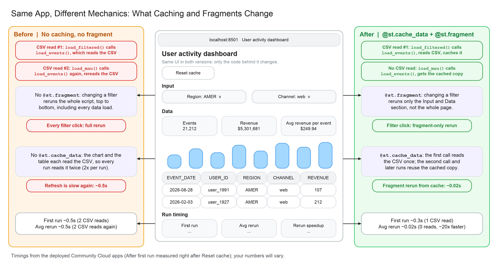

# Streamlit caching with CoCo: tutorial companion app

A Streamlit app is easy to build until users start clicking filters. Every click reruns the whole script from top to bottom, and every data load runs again, even when nothing about the data changed. In this demo, the table and the chart each load the data, so the uncached app reads it twice on every click.

Two small changes fix this. `@st.cache_data` loads the data once and reuses it, and `@st.fragment` limits a filter click to rerunning just the filter section. In the deployed demo, reruns dropped from ~0.5s to ~0.02s.



Try both versions live: [before](https://st-before-caching.streamlit.app) and [after](https://st-after-caching.streamlit.app).

## What's in this repo

Two versions of the same user-activity dashboard, built on a bundled CSV of 200k synthetic events (`data/user_events.csv`, about 5% with no region). Locally and on Streamlit Community Cloud, the apps read the CSV, so no Snowflake credentials are needed. Deployed in Streamlit in Snowflake, they query a `USER_EVENTS_DEMO` table through the app's Snowpark session instead.

- `before/` is a typical first draft: no caching, no fragment, no edge-case handling.
- `after/` is the same file after running the CoCo prompts from the email.

They share the same layout and function names, so `diff before/streamlit_app.py after/streamlit_app.py` shows only the fixes.

## Run locally

```bash
pip install -r after/requirements.txt
streamlit run before/streamlit_app.py --server.port 8601
streamlit run after/streamlit_app.py --server.port 8602
```

Each app has a **Reset cache** button and a **Run timing** panel showing the first run, the average rerun, and every logged run. Click Reset, change the Region filter a few times, and compare the two apps.

## Proposed changes (before → after)

### Prompt 1: Stop runaway reruns

> "Refactor these data loads to use @st.cache_data, and convert the filter section into an @st.fragment."

| Function | Added in `after/` | Effect |
|---|---|---|
| `load_events()` | `@st.cache_data` | CSV is read once instead of on every rerun |
| `load_filtered()` | `@st.cache_data` | Each filter combination is computed once |
| `load_mau()` | `@st.cache_data` | Monthly active users is aggregated once |
| `filtered_section()` | `@st.fragment` | Changing a filter reruns only the Input section, not the whole script |

### Prompt 2: Defend against edge cases

> "Audit this app as an unsupervised stakeholder. What breaks if a filter returns 0 rows or if a column has unexpected nulls?"

What CoCo should find in `before/`:
- Clearing a multiselect gives 0 rows, and "Avg revenue per event" shows `$nan`.
- About 5% of rows have no region. `isin()` silently drops them, so the totals look complete but aren't.

Fixes in `after/`:
- A warning when a multiselect is empty, returned before any data is loaded.
- `st.info` for 0-row results instead of `$nan` metrics.
- Missing regions filled as "Unknown", a selectable "Unknown" option, and a caption counting those rows.
- `fillna(0)` on revenue and an empty-chart guard.

### Prompt 3: Automate the SQL layer

This prompt ("Write a Snowpark query ... feed it directly into an st.bar_chart") needs a Snowflake table, so it isn't part of this CSV demo. Try it on your own app in Snowsight.
